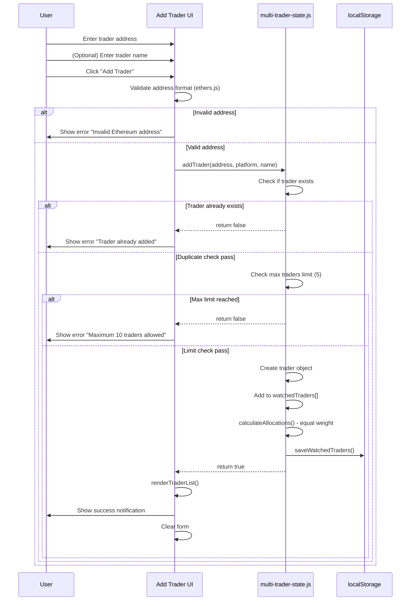

# Technical Specification: Multiple Trader Configuration

## Overview

Implement UI components and workflows for adding, managing, and displaying multiple traders in the copy trading portfolio. This leverages the existing `multi-trader-state.js` infrastructure with minimal modifications.

**Story**: [Multiple Trader Configuration](./story.md)

**Complexity**: Low (UI bindings to existing backend logic)

**Estimated Effort**: 2-3 days

## Architecture

### System Context

```
┌─────────────────────────────────────────────────────────────┐
│                     Multi-Trader Portfolio                  │
│                                                             │
│  ┌──────────────┐      ┌──────────────────────────────┐   │
│  │  User Input  │─────>│   Trader Configuration UI     │   │
│  │   (Form)     │      │  - Add Trader Form            │   │
│  └──────────────┘      │  - Trader List Display        │   │
│                        │  - Pause/Resume/Remove BTNs   │   │
│                        └───────────┬──────────────────────┘   │
│                                    │                          │
│                                    │ Calls existing functions │
│                                    ▼                          │
│                        ┌──────────────────────────────┐      │
│                        │  multi-trader-state.js       │      │
│                        │  ✅ Already Implemented:     │      │
│                        │  - addTrader()               │      │
│                        │  - removeTrader()            │      │
│                        │  - toggleTraderActive()      │      │
│                        │  - calculateAllocations()    │      │
│                        │  - saveWatchedTraders()      │      │
│                        └──────────┬───────────────────┘      │
│                                   │                          │
│                                   ▼                          │
│                        ┌──────────────────────────────┐      │
│                        │      localStorage            │      │
│                        │  'multi_trader_watched...'   │      │
│                        └──────────────────────────────┘      │
└─────────────────────────────────────────────────────────────┘
```

### Component Architecture

**New Components** (UI layer):
1. **AddTraderForm** - Form for adding new traders
2. **TraderList** - Display list of added traders
3. **TraderItem** - Individual trader row with controls

**Existing Components** (No changes needed):
- `multiState` in `multi-trader-state.js` (✅ Complete)
- `addTrader()`, `removeTrader()`, `toggleTraderActive()` (✅ Complete)
- `calculateAllocations()` (✅ Complete - equal strategy)
- localStorage persistence (✅ Complete)

## Data Flow

### Sequence Diagram: Add Trader Flow



## Implementation Design

### 1. Add Trader Form Component

**Location**: `js/ui-multi-trader.js` (new file)

**HTML Structure**:
```html
<div id="add-trader-section" class="config-section">
  <h3>Add Trader</h3>
  <form id="add-trader-form" class="trader-form">
    <div class="form-group">
      <label for="trader-address">Trader Address *</label>
      <input
        type="text"
        id="trader-address"
        placeholder="0x..."
        pattern="^0x[a-fA-F0-9]{40}$"
        required
      />
      <small>Ethereum address format</small>
    </div>

    <div class="form-group">
      <label for="trader-name">Trader Name (Optional)</label>
      <input
        type="text"
        id="trader-name"
        placeholder="Gemini 2.5 Pro"
        maxlength="50"
      />
    </div>

    <div class="form-group">
      <label for="trader-platform">Platform</label>
      <select id="trader-platform">
        <option value="moonlander">Moonlander</option>
        <option value="hyperliquid">Hyperliquid</option>
      </select>
    </div>

    <button type="submit" class="btn-primary">Add Trader</button>
  </form>

  <div id="trader-count-info" class="info-badge">
    <span id="active-traders-count">0</span> / 10 traders added
  </div>
</div>
```

**JavaScript Handler**:
```javascript
// js/ui-multi-trader.js
import { ethers } from 'ethers';
import {
  multiState,
  addTrader,
  calculateAllocations,
  addActivityLog
} from './multi-trader-state.js';

/**
 * Initialize Add Trader form
 */
export function initAddTraderForm() {
  const form = document.getElementById('add-trader-form');
  if (!form) return;

  form.addEventListener('submit', handleAddTrader);
}

/**
 * Handle Add Trader form submission
 */
async function handleAddTrader(event) {
  event.preventDefault();

  const addressInput = document.getElementById('trader-address');
  const nameInput = document.getElementById('trader-name');
  const platformSelect = document.getElementById('trader-platform');

  const address = addressInput.value.trim();
  const name = nameInput.value.trim() || null;
  const platform = platformSelect.value;

  // Validate address format
  if (!ethers.utils.isAddress(address)) {
    showNotification('error', 'Invalid Ethereum address format');
    addressInput.focus();
    return;
  }

  // Add trader using existing function
  const success = addTrader(address, platform, name);

  if (!success) {
    // Error handling (duplicate, max limit)
    if (multiState.watchedTraders.some(t => t.address.toLowerCase() === address.toLowerCase())) {
      showNotification('error', 'Trader already added');
    } else if (multiState.watchedTraders.length >= 10) {
      showNotification('error', 'Maximum 10 traders allowed');
    } else {
      showNotification('error', 'Failed to add trader');
    }
    return;
  }

  // Success - update UI
  showNotification('success', `Trader added: ${name || address.substring(0, 10)}...`);
  addActivityLog('success', `Trader added: ${name || address}`);

  // Refresh trader list
  renderTraderList();
  updateTraderCount();

  // Clear form
  form.reset();
  addressInput.focus();
}

/**
 * Display notification to user
 */
function showNotification(type, message) {
  // Implementation: Toast notification or banner
  const notification = document.createElement('div');
  notification.className = `notification notification-${type}`;
  notification.textContent = message;

  document.body.appendChild(notification);

  setTimeout(() => {
    notification.remove();
  }, 3000);
}
```

### 2. Trader List Component

**HTML Structure**:
```html
<div id="trader-list-section" class="config-section">
  <h3>Watched Traders</h3>

  <div id="trader-list" class="trader-list">
    <!-- Dynamically populated -->
  </div>

  <div id="empty-state" class="empty-state">
    <p>No traders added yet. Add your first trader above.</p>
  </div>
</div>
```

**JavaScript Renderer**:
```javascript
// js/ui-multi-trader.js

/**
 * Render trader list
 */
export function renderTraderList() {
  const container = document.getElementById('trader-list');
  const emptyState = document.getElementById('empty-state');

  if (!container) return;

  // Get traders from state
  const traders = multiState.watchedTraders;

  if (traders.length === 0) {
    container.innerHTML = '';
    emptyState.style.display = 'block';
    return;
  }

  emptyState.style.display = 'none';

  // Render traders
  container.innerHTML = traders.map((trader, index) => `
    <div class="trader-item ${trader.isActive ? 'active' : 'paused'}" data-address="${trader.address}">
      <div class="trader-info">
        <div class="trader-header">
          <span class="trader-name">${trader.name}</span>
          <span class="badge badge-${trader.platform}">${trader.platform}</span>
          <span class="badge badge-${trader.isActive ? 'active' : 'paused'}">
            ${trader.isActive ? 'Active' : 'Paused'}
          </span>
        </div>

        <div class="trader-details">
          <span class="trader-address" title="${trader.address}">
            ${shortenAddress(trader.address)}
            <button
              class="btn-icon"
              onclick="copyToClipboard('${trader.address}')"
              title="Copy address"
            >
              📋
            </button>
          </span>

          <span class="trader-allocation">
            ${trader.allocation.toFixed(1)}% allocation
          </span>

          ${trader.lastSync ? `
            <span class="trader-sync">
              Last sync: ${formatTimestamp(trader.lastSync)}
            </span>
          ` : ''}
        </div>
      </div>

      <div class="trader-actions">
        ${trader.isActive ? `
          <button
            class="btn-secondary"
            onclick="handlePauseTrader('${trader.address}')"
          >
            Pause
          </button>
        ` : `
          <button
            class="btn-primary"
            onclick="handleResumeTrader('${trader.address}')"
          >
            Resume
          </button>
        `}

        <button
          class="btn-danger"
          onclick="handleRemoveTrader('${trader.address}')"
        >
          Remove
        </button>
      </div>
    </div>
  `).join('');
}

/**
 * Shorten Ethereum address for display
 */
function shortenAddress(address) {
  return `${address.substring(0, 6)}...${address.substring(address.length - 4)}`;
}

/**
 * Format timestamp
 */
function formatTimestamp(timestamp) {
  const date = new Date(timestamp);
  const now = Date.now();
  const diff = now - timestamp;

  // Less than 1 minute
  if (diff < 60000) {
    return 'Just now';
  }

  // Less than 1 hour
  if (diff < 3600000) {
    const minutes = Math.floor(diff / 60000);
    return `${minutes}m ago`;
  }

  // Less than 24 hours
  if (diff < 86400000) {
    const hours = Math.floor(diff / 3600000);
    return `${hours}h ago`;
  }

  // More than 24 hours
  return date.toLocaleDateString();
}

/**
 * Copy address to clipboard
 */
function copyToClipboard(text) {
  navigator.clipboard.writeText(text).then(() => {
    showNotification('success', 'Address copied to clipboard');
  }).catch(err => {
    console.error('Failed to copy:', err);
    showNotification('error', 'Failed to copy address');
  });
}
```

### 3. Trader Actions Handlers

**JavaScript Functions**:
```javascript
// js/ui-multi-trader.js
import {
  toggleTraderActive,
  removeTrader,
  calculateAllocations,
  addActivityLog
} from './multi-trader-state.js';

/**
 * Handle pause trader
 */
window.handlePauseTrader = function(address) {
  toggleTraderActive(address, false);
  calculateAllocations(); // Recalculate for active traders only
  addActivityLog('info', `Trader paused: ${address}`);
  renderTraderList();
  updateTraderCount();
  showNotification('success', 'Trader paused');
};

/**
 * Handle resume trader
 */
window.handleResumeTrader = function(address) {
  toggleTraderActive(address, true);
  calculateAllocations(); // Recalculate with resumed trader
  addActivityLog('success', `Trader resumed: ${address}`);
  renderTraderList();
  updateTraderCount();
  showNotification('success', 'Trader resumed');
};

/**
 * Handle remove trader
 */
window.handleRemoveTrader = function(address) {
  // Confirmation dialog
  const trader = multiState.watchedTraders.find(
    t => t.address.toLowerCase() === address.toLowerCase()
  );

  if (!trader) return;

  const confirmMessage = `Remove trader "${trader.name}"? This will close all their positions.`;

  if (!confirm(confirmMessage)) {
    return;
  }

  // Remove trader using existing function
  const success = removeTrader(address);

  if (!success) {
    showNotification('error', 'Failed to remove trader');
    return;
  }

  calculateAllocations(); // Recalculate without removed trader
  addActivityLog('warning', `Trader removed: ${trader.name}`);
  renderTraderList();
  updateTraderCount();
  showNotification('success', 'Trader removed');
};

/**
 * Update trader count display
 */
function updateTraderCount() {
  const countElement = document.getElementById('active-traders-count');
  if (!countElement) return;

  const activeCount = multiState.watchedTraders.filter(t => t.isActive).length;
  const totalCount = multiState.watchedTraders.length;

  countElement.textContent = totalCount;

  // Update info message
  const infoElement = document.getElementById('trader-count-info');
  if (infoElement) {
    infoElement.textContent = `${totalCount} / 10 traders added (${activeCount} active)`;
  }
}
```

## Integration Points

### 1. With Existing State Management

**File**: `js/multi-trader-state.js`

**No changes needed** - UI simply calls existing functions:
- `addTrader(address, platform, name, allocation)` - Already implemented
- `removeTrader(address)` - Already implemented
- `toggleTraderActive(address, isActive)` - Already implemented
- `calculateAllocations()` - Already implemented (equal strategy)
- `saveWatchedTraders()` - Called automatically by state functions

### 2. With Configuration

**File**: `js/config.js`

**Add constants** (if not present):
```javascript
// Multi-trader settings
export const MAX_TRADERS = 10; // Maximum number of traders
export const MIN_TRADER_NAME_LENGTH = 1;
export const MAX_TRADER_NAME_LENGTH = 50;
```

### 3. With Main Application

**File**: `js/main.js` or `multi-trader.html`

**Initialize UI** on page load:
```javascript
import { initAddTraderForm, renderTraderList } from './ui-multi-trader.js';
import { loadMultiTraderState } from './multi-trader-state.js';

// On DOM ready
document.addEventListener('DOMContentLoaded', () => {
  // Load persisted state
  loadMultiTraderState();

  // Initialize UI components
  initAddTraderForm();
  renderTraderList();
  updateTraderCount();
});
```

## Testing Strategy

### Unit Tests

**Test File**: `tests/test-trader-management.js`

**Test Cases**:
1. ✅ Add trader with valid address
2. ✅ Reject invalid Ethereum address format
3. ✅ Prevent duplicate traders (case-insensitive)
4. ✅ Enforce maximum traders limit (10)
5. ✅ Equal allocation calculation (3 traders = 33.3% each)
6. ✅ Allocation update on trader add/remove
7. ✅ Pause trader sets allocation to 0
8. ✅ Resume trader recalculates allocation
9. ✅ Remove trader updates allocations
10. ✅ localStorage persistence (save/load)

### Integration Tests

**Test File**: `tests/test-trader-ui-integration.js`

**Test Scenarios**:
1. Submit add trader form with valid data
2. Display validation error for invalid address
3. Render trader list correctly
4. Pause/resume trader updates UI
5. Remove trader with confirmation
6. Update trader count badge

### Manual Testing Checklist

- [ ] Add first trader - allocation shows 100%
- [ ] Add second trader - both show 50%
- [ ] Add third trader - all show 33.3%
- [ ] Pause one trader - active traders split 100%
- [ ] Resume trader - all active split equally
- [ ] Remove trader - remaining split equally
- [ ] Try to add 11th trader - see error message
- [ ] Try to add duplicate address - see error message
- [ ] Refresh page - traders persist from localStorage
- [ ] Copy address to clipboard - works
- [ ] Long trader name - truncates properly

## Similar Code References

### From `multi-trader-state.js`:

**Add Trader Function** (Lines 174-210):
```javascript
export function addTrader(address, platform = 'moonlander', name = null, allocation = null) {
  // Check if trader already exists
  if (multiState.watchedTraders.some(t => t.address.toLowerCase() === address.toLowerCase())) {
    console.warn('Trader already exists:', address);
    return false;
  }

  // Check max traders limit
  if (multiState.watchedTraders.length >= multiState.config.maxTraders) {
    console.warn('Maximum traders limit reached:', multiState.config.maxTraders);
    return false;
  }

  const trader = {
    address: address.toLowerCase(),
    platform,
    name: name || `Trader ${address.substring(0, 8)}...`,
    allocation: allocation || 0,
    isActive: true,
    addedAt: Date.now(),
    performance: { pnl: 0, winRate: 0, totalTrades: 0, sharpeRatio: 0, roi: 0 },
    positions: [],
    lastSync: null,
  };

  multiState.watchedTraders.push(trader);
  saveWatchedTraders();

  console.log('Trader added:', trader);
  return true;
}
```

**Calculate Allocations - Equal Strategy** (Lines 339-344):
```javascript
case 'equal':
  // Equal allocation to all active traders
  const equalAllocation = 100 / activeTraders.length;
  activeTraders.forEach(trader => {
    trader.allocation = equalAllocation;
  });
  break;
```

**Toggle Trader Active** (Lines 289-301):
```javascript
export function toggleTraderActive(address, isActive) {
  const trader = multiState.watchedTraders.find(
    t => t.address.toLowerCase() === address.toLowerCase()
  );

  if (!trader) {
    console.warn('Trader not found:', address);
    return;
  }

  trader.isActive = isActive;
  saveWatchedTraders();
}
```

## CSS Styling

**File**: `css/multi-trader.css` (new file)

```css
/* Add Trader Form */
.trader-form {
  display: flex;
  flex-direction: column;
  gap: 1rem;
}

.form-group {
  display: flex;
  flex-direction: column;
  gap: 0.5rem;
}

.form-group label {
  font-weight: 600;
  font-size: 0.9rem;
}

.form-group input,
.form-group select {
  padding: 0.5rem;
  border: 1px solid #ccc;
  border-radius: 4px;
  font-size: 1rem;
}

.form-group small {
  color: #666;
  font-size: 0.85rem;
}

/* Trader List */
.trader-list {
  display: flex;
  flex-direction: column;
  gap: 1rem;
}

.trader-item {
  border: 1px solid #ddd;
  border-radius: 8px;
  padding: 1rem;
  display: flex;
  justify-content: space-between;
  align-items: center;
  background: #fff;
}

.trader-item.paused {
  opacity: 0.6;
  background: #f5f5f5;
}

.trader-info {
  flex: 1;
}

.trader-header {
  display: flex;
  align-items: center;
  gap: 0.5rem;
  margin-bottom: 0.5rem;
}

.trader-name {
  font-weight: 600;
  font-size: 1.1rem;
}

.badge {
  padding: 0.25rem 0.5rem;
  border-radius: 4px;
  font-size: 0.75rem;
  font-weight: 600;
  text-transform: uppercase;
}

.badge-active {
  background: #4caf50;
  color: white;
}

.badge-paused {
  background: #ff9800;
  color: white;
}

.badge-moonlander {
  background: #2196f3;
  color: white;
}

.badge-hyperliquid {
  background: #9c27b0;
  color: white;
}

.trader-details {
  display: flex;
  flex-direction: column;
  gap: 0.25rem;
  font-size: 0.9rem;
  color: #666;
}

.trader-address {
  font-family: monospace;
}

.trader-actions {
  display: flex;
  gap: 0.5rem;
}

/* Buttons */
.btn-primary,
.btn-secondary,
.btn-danger {
  padding: 0.5rem 1rem;
  border: none;
  border-radius: 4px;
  cursor: pointer;
  font-size: 0.9rem;
  font-weight: 600;
}

.btn-primary {
  background: #4caf50;
  color: white;
}

.btn-secondary {
  background: #ff9800;
  color: white;
}

.btn-danger {
  background: #f44336;
  color: white;
}

.btn-icon {
  background: none;
  border: none;
  cursor: pointer;
  font-size: 1rem;
}

/* Notifications */
.notification {
  position: fixed;
  top: 20px;
  right: 20px;
  padding: 1rem;
  border-radius: 4px;
  box-shadow: 0 2px 8px rgba(0, 0, 0, 0.2);
  z-index: 1000;
  animation: slideIn 0.3s ease;
}

.notification-success {
  background: #4caf50;
  color: white;
}

.notification-error {
  background: #f44336;
  color: white;
}

@keyframes slideIn {
  from {
    transform: translateX(100%);
    opacity: 0;
  }
  to {
    transform: translateX(0);
    opacity: 1;
  }
}

/* Info Badge */
.info-badge {
  margin-top: 1rem;
  padding: 0.5rem;
  background: #e3f2fd;
  border-radius: 4px;
  text-align: center;
  font-size: 0.9rem;
}

/* Empty State */
.empty-state {
  text-align: center;
  padding: 2rem;
  color: #999;
}
```

## Files to Create/Modify

### New Files
- `js/ui-multi-trader.js` - UI components and handlers (~300 lines)
- `css/multi-trader.css` - Styling (~200 lines)
- `tests/test-trader-management.js` - Unit tests (~200 lines)

### Modified Files
- `multi-trader.html` - Add HTML structure for form and list (~100 lines added)
- `js/main.js` - Initialize multi-trader UI (~10 lines added)
- `js/config.js` - Add MAX_TRADERS constant (~5 lines added)

### No Changes Needed
- ✅ `js/multi-trader-state.js` - Already complete
- ✅ `js/utils.js` - Already has needed utilities
- ✅ `js/hyperliquid-service.js` - No changes needed
- ✅ `js/moonlander-service.js` - No changes needed

## Security Considerations

1. **Address Validation**: Use `ethers.utils.isAddress()` for format validation
2. **XSS Prevention**: Sanitize trader names before rendering
3. **localStorage Security**: Never persist private keys (already handled in multi-trader-state.js)
4. **Confirmation Dialogs**: Require confirmation for destructive actions (remove trader)

## Performance Considerations

1. **Efficient Rendering**: Only re-render trader list when state changes
2. **Event Delegation**: Use event delegation for dynamic trader list items
3. **Debouncing**: Debounce rapid add/remove operations
4. **localStorage Throttling**: Batch localStorage writes to reduce I/O

## Accessibility

1. **Keyboard Navigation**: All actions accessible via keyboard
2. **Screen Readers**: Proper ARIA labels and roles
3. **Focus Management**: Logical tab order
4. **Error Announcements**: Screen reader announcements for errors/success

## Next Steps

1. **Implementation**: Create UI components following this spec
2. **Testing**: Write and run unit tests
3. **Integration**: Connect UI to existing multi-trader-state.js
4. **Manual Testing**: Test all user flows
5. **Move to Next Spec**: Position Conflict Resolution

---

**Note**: This spec leverages 90% existing infrastructure from `multi-trader-state.js`. Implementation is primarily UI work - no complex logic needed.
